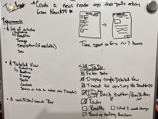
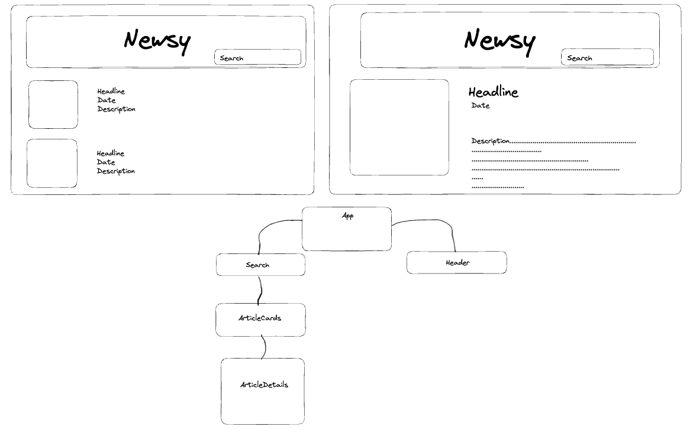
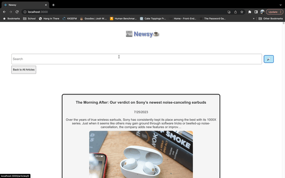

Steps 2 and 3 are great places to talk about any challenges you experienced and how you overcame them, what resources you used, why you choose certain design decisions (page layout, filter options, routes, schema, etc.), and what features or changes you would implement next if you had more time to work on it.

# 📰 Newsy☕️

## Abstract

This web application was designed as part of a take home challenge. I was required to pull various news articles from an api and display them on a home page. The user is able to click on each article and discover more information about the article as well as go to the site where it was originally published. I also needed to create functionality that allowed the user to search terms or phrases to see if any articles matched what they were looking for.

This web app is also responsive for all device usage.

## Setup

Fork and clone this [repo](https://github.com/Devynnem/newsy)

Do the following steps for the repo.

In your forked GitHub repository, click the code drop-down menu and copy the SSH key. 
Open the terminal on your machine and navigate to the containing directory you’d like - to clone the repository folder and its contents to. On the command line, run “git clone” + the SSH key you copied earlier. A new folder will be created containing a local copy of the repository linked to the forked repository you created - enter the new directory.

Install the library dependencies:

Run: ```npm install```
Next: ```npm start``` in the terminal to see the HTML page

```Control + C``` is the command to stop running the local server

## Deployed Link

You can also visit the web page at this [link]()

## Preview of Setup and Finished App







## Refelctions

Challenges: I implemented using Hooks for the second time in my developer career and found it a little challenging to grasp when and where to use them. I also found it challenge knowing exactly what skills to showcase for a potential employer based off a small amount of time and small spec. 

Wins: Making web applications using React is getting easier and more seamless. After the initail struggle when data does not display how I think it should, I enoy working through the process to make it work!

## Technologies Used:
React | Cypress | API | CSS | JSX

## Countributors:
  
Devynne Marshall ([LinkedIn](https://www.linkedin.com/in/devynnemarshall/) || [github](https://github.com/Devynnem))  